[](https://honghong.me)

[](https://honghong.me)
[](https://wakatime.com/@tszhong0411)

<h2>Hi 👋, I'm 小康</h2>
<h3>A student who loves web development</h3>

- 🔭 I'm currently working on [honghong.me](https://github.com/tszhong0411/honghong.me)

- 🌱 I'm currently learning **Next.js**

- 👨‍💻 All of my projects are available at [https://honghong.me/projects](https://honghong.me/projects)

- 📝 I regularly write articles on [https://honghong.me](https://honghong.me)

- 💬 Ask me about **react, next.js, node.js**

- 📫 How to reach me **info@honghong.me**

<h3 align="left">Connect with me:</h3>

[](https://codepen.io/tszhong0411#gh-light-mode-only)
[](https://codepen.io/tszhong0411#gh-dark-mode-only)
[](https://dev.to/tszhong0411#gh-light-mode-only)
[](https://dev.to/tszhong0411#gh-dark-mode-only)
[](https://twitter.com/tszhonglai0411#gh-light-mode-only)
[](https://twitter.com/tszhonglai0411#gh-dark-mode-only)
[](https://stackoverflow.com/users/15166428/tszhong0411#gh-light-mode-only)
[](https://stackoverflow.com/users/15166428/tszhong0411#gh-dark-mode-only)
[](https://codesandbox.io/u/TszHong#gh-light-mode-only)
[](https://codesandbox.io/u/TszHong#gh-dark-mode-only)
[](https://fb.com/tszhonglai.0411#gh-light-mode-only)
[](https://fb.com/tszhonglai.0411#gh-dark-mode-only)
[](https://instagram.com/tszhong0411#gh-light-mode-only)
[](https://instagram.com/tszhong0411#gh-dark-mode-only)
[](https://www.youtube.com/c/小康#gh-light-mode-only)
[](https://www.youtube.com/c/小康#gh-dark-mode-only)
[](https://honghong.me/rss.xml#gh-light-mode-only)
[](https://honghong.me/rss.xml#gh-dark-mode-only)

<h3 align="left">Languages and Tools:</h3>

[](https://html.spec.whatwg.org/#gh-light-mode-only)
[](https://html.spec.whatwg.org/#gh-dark-mode-only)
[](https://www.w3.org/Style/CSS/#gh-light-mode-only)
[](https://www.w3.org/Style/CSS/#gh-dark-mode-only)
[](https://developer.mozilla.org/en-US/docs/Web/JavaScript#gh-light-mode-only)
[](https://developer.mozilla.org/en-US/docs/Web/JavaScript#gh-dark-mode-only)
[](https://www.typescriptlang.org#gh-light-mode-only)
[](https://www.typescriptlang.org#gh-dark-mode-only)
[](https://nextjs.org#gh-light-mode-only)
[](https://nextjs.org#gh-dark-mode-only)
[](https://reactjs.org#gh-light-mode-only)
[](https://reactjs.org#gh-dark-mode-only)
[](https://www.figma.com#gh-light-mode-only)
[](https://www.figma.com#gh-dark-mode-only)
[](https://git-scm.com#gh-light-mode-only)
[](https://git-scm.com#gh-dark-mode-only)
[](https://hexo.io#gh-light-mode-only)
[](https://hexo.io#gh-dark-mode-only)
[](https://jestjs.io#gh-light-mode-only)
[](https://jestjs.io#gh-dark-mode-only)
[](https://nodejs.org#gh-light-mode-only)
[](https://nodejs.org#gh-dark-mode-only)
[](https://www.postgresql.org#gh-light-mode-only)
[](https://www.postgresql.org#gh-dark-mode-only)
[](https://www.python.org#gh-light-mode-only)
[](https://www.python.org#gh-dark-mode-only)
[](https://tailwindcss.com/#gh-light-mode-only)
[](https://tailwindcss.com/#gh-dark-mode-only)

### 📊 Weekly development breakdown

<!--START_SECTION:waka-->

```text
Total Time: 33 hrs 53 mins

TypeScript    21 hrs 42 mins  ⣿⣿⣿⣿⣿⣿⣿⣿⣿⣿⣿⣿⣿⣿⣿⣦⣀⣀⣀⣀⣀⣀⣀⣀⣀   62.31 %
JSON          5 hrs           ⣿⣿⣿⣶⣀⣀⣀⣀⣀⣀⣀⣀⣀⣀⣀⣀⣀⣀⣀⣀⣀⣀⣀⣀⣀   14.35 %
JavaScript    1 hr 41 mins    ⣿⣄⣀⣀⣀⣀⣀⣀⣀⣀⣀⣀⣀⣀⣀⣀⣀⣀⣀⣀⣀⣀⣀⣀⣀   04.85 %
CSS           1 hr 33 mins    ⣿⣄⣀⣀⣀⣀⣀⣀⣀⣀⣀⣀⣀⣀⣀⣀⣀⣀⣀⣀⣀⣀⣀⣀⣀   04.49 %
Markdown      1 hr 26 mins    ⣿⣀⣀⣀⣀⣀⣀⣀⣀⣀⣀⣀⣀⣀⣀⣀⣀⣀⣀⣀⣀⣀⣀⣀⣀   04.15 %
TSConfig      58 mins         ⣶⣀⣀⣀⣀⣀⣀⣀⣀⣀⣀⣀⣀⣀⣀⣀⣀⣀⣀⣀⣀⣀⣀⣀⣀   02.81 %
```

<!--END_SECTION:waka-->

---

<p align="center">Made with ❤️ in Hong Kong</p>
